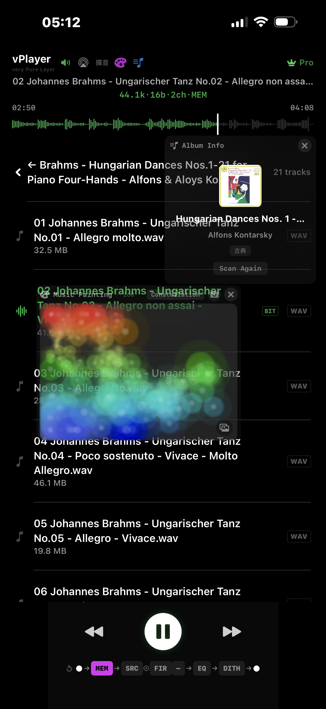
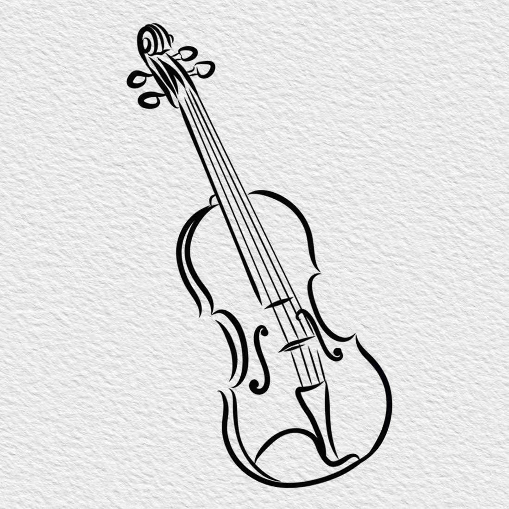

<p align="center">
  
</p>

<h1 align="center">vPlayer HiFi</h1>

<p align="center">
  <i>vPlayer means Very Pure Layer</i> — a layered audio pipeline that makes every processing step visible and independently controllable.
</p>

<p align="center">
  <a href="https://apps.apple.com/cn/app/vplayer-hifi/id6783141736"></a>
</p>

---

## Why vPlayer HiFi

Apple Music doesn't support FLAC, DSD, or SACD-ISO. Most HiFi players on the App Store require subscriptions or transcode in the cloud. vPlayer HiFi runs a **complete audio engine locally on your iPhone** — sample-rate conversion, oversampling, DSD decoding, and room correction all happen offline. Your files never leave your device. Breathe life back into the music collection sitting silent on your NAS and hard drives — the one you spent years curating, organizing, and never quite found the right player for.

## Philosophy

iPhone's built-in DAC is limited to 44.1 / 48 kHz — that's the ceiling Apple ships. vPlayer's **DSD Decoder and SRC/FIR oversampling engine** pushes beyond it to 176.4 / 352.8 kHz in real time, with some build-int filter types to match your taste. Every step in the pipeline — SRC → FIR → Dither → EQ — can be toggled on/off independently for A/B comparison. Find the combination that pleases *your* ears.

## Features

| Module | Description |
|--------|-------------|
| **SRC** | 7 algorithms: Linear, Sinc (32–512 tap), Minring (64-tap minimum-phase). Independent integer-ratio up/down-sampling with per-genre recommendations |
| **FIR Oversampling** | 2× / 4× / 8×, 5 filter types: Linear Phase, Minimum Phase, Apolising (gentle roll-off), FS4 (fs/4 ultra-gentle), None. 31 / 63 / 127 tap, per-filter tap limiting |
| **DSD Decoding** | DSD64–DSD512 → PCM, 4 output rates (44.1k–705.6k) |
| **SACD ISO** | Native ISO parsing, DST decompression, track browser |
| **Room EQ** | Log sweep → FFT deconvolution → dual-window Tukey analysis → room correction with Warm / Flat target curves. Modal-dip protection, Schroeder zoning, measured RT60 |
| **10-band Graphic EQ** | Bundled presets (Classical, Jazz, Vocal Boost, etc.) |
| **SMB Playback** | Stream directly from NAS via SMB2/3 — no download required |
| **Memory Preload** | Buffer entire tracks in RAM, bypassing disk I/O |
| **TPDF Dither** | Professional dithering for bit-depth reduction |

### Supported Formats

WAV · FLAC · AIFF · MP3 · M4A · DSF · DFF · SACD-R ISO

### Ecosystem

- **AirPlay** — stream to Studio Display, Apple TV, HomePod. Route-adaptive IO buffer tuning
- **Bluetooth** — AAC / aptX / LDAC handled automatically by iOS. Automatic AudioUnit rebuild on route change
- **External DAC** — working with your external DAC
- **One Apple ID** — purchase once, works across your iPhones and iPads

---

## Versions

| | vPlayer HiFi | vPlayer HiFi Youth |
|---|---|---|
| **iOS** | 17.0+ | 15.0+ |
| **Devices** | iPhone 15 Pro Max and later | iPhone 7 through iPhone X |
| **DSP** | Full pipeline: DSD512, 127-tap FIR | Same Pro features, optimized for older hardware |
| **Design** | Light / Dark themes | Dark mode |

> Turn your retired iPhone 7~X into a dedicated HiFi transport — plug it into a DAC and leave it permanently connected to your stereo.

---

## Architecture

```
┌──────────────────────────────────────────┐
│  SwiftUI                                 │
│  File Browser · Now Playing · Settings   │
├──────────────────────────────────────────┤
│  AudioManager (Swift)                    │
│  Routing · Gating · AirPlay/BT Buffer    │
├──────────────────────────────────────────┤
│  AudioEngine (ObjC)                      │
│  AudioUnit RemoteIO → Render Callback    │
│  SRC (C++) · FIR · TPDF · DSD→PCM        │
├──────────────────────────────────────────┤
│  Decoders                                │
│  WAV · FLAC · SACD ISO · DSD · SMB       │
└──────────────────────────────────────────┘
```

All DSP — FIR convolution, SRC interpolation — runs on the **real-time audio thread** using Accelerate / vDSP. Zero main-thread blocking.

Add music files via AirDrop, the Files app, or SMB.

---

## Roadmap

- **tvOS** — Apple TV wired to NAS, HDMI out to AV receiver
- **macOS** — USB DAC with native CoreAudio HAL, high-rate PCM / DSD output

---

## App Store

**[vPlayer HiFi on the App Store](https://apps.apple.com/cn/app/vplayer-hifi/id6783141736)**

- **vPlayer Pro** — one-time purchase: unlocks SRC, FIR, DSD, SACD, Room EQ, SMB, Memory Playback. Some Lab features are available individually.

---

<p align="center">
  
</p>

*"v" stands for Very Pure Layer — and also for violin, our app icon.*

Support: shanleiguang@gmail.com
